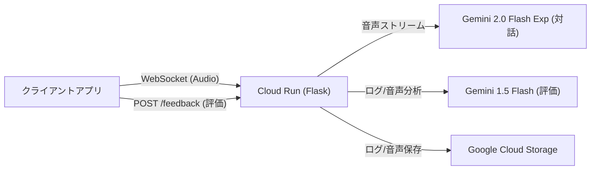

# Live Talk Service (Backend)

Google Gemini API (Multimodal Live API) を活用したリアルタイム音声対話アプリケーションのバックエンドサービスです。
Flask と WebSocket を使用して、低遅延での AI とのストリーミング対話を実現し、会話ログを Google Cloud Storage (GCS) に保存します。

## 📖 特徴

- **リアルタイム音声対話**: WebSocket と Gemini 2.0 Flash Exp モデルによる低遅延な音声対話。
- **ストリーミング応答**: Gemini API の `response_modalities=["AUDIO"]` を利用し、生成された音声を即座にクライアントへ送信。
- **会話ログ保存**: 会話の内容と音声データを Google Cloud Storage に自動バックアップ。
- **自動評価機能**: 会話終了後、Gemini 1.5 Flash (マルチモーダル) が音声とログを分析し、フィードバックを生成。
- **スケーラビリティ**: Google Cloud Run 上でのサーバーレス動作（コンテナベース）。
- **Docker 対応**: 軽量な `python:3.10-slim` ベースのコンテナイメージ。

## 🏗️ アーキテクチャ



## 📂 ディレクトリ構成

```text
.
├── .env                    # 環境変数（Git管理外）
├── .gitignore
├── .github/
│   └── workflows/
│       └── deploy.yml      # CI/CD設定
├── .vscode/
│   └── settings.json       # VS Code設定
├── Dockerfile
├── README.md
├── app.py                  # メインアプリケーション
├── prompts.py              # AIプロンプト定義
├── service_account.json    # GCPサービスアカウント（Git管理外）
├── requirements.txt
├── docks/
│   └── set.ini
├── logs/                   # ローカルログ（Git管理外）
└── templates/
    └── index.html
```

## 🚀 ローカルでのセットアップと実行

### 前提条件

- Python 3.10 以上
- Google Cloud プロジェクト（Gemini API キー取得済み）

### 1\. リポジトリのクローン

```bash
git clone <https://github.com/ktwebsite/live_talk_app_realtime>
cd live-talk-service
```

### 2\. 仮想環境の作成と依存関係のインストール

```bash
python -m venv venv
source venv/bin/activate  # Windowsの場合は: venv\Scripts\activate
pip install -r requirements.txt
```

### 3\. 環境変数の設定

`.env` ファイルを作成するか、ターミナルで環境変数をエクスポートします。

**必須:**

```bash
export GEMINI_API_KEY="AIzaSy..."
```

**任意 (ログ保存機能を使う場合):**

```bash
export GCS_BUCKET_NAME="your-bucket-name"
export GOOGLE_APPLICATION_CREDENTIALS="/path/to/key.json" # ローカル実行時のみ必要
```

### 4\. アプリケーションの起動

```bash
python app.py
```

起動後、 `ws://localhost:5000/ws/realtime` で WebSocket 接続が可能です。

---

## 📡 API 仕様

### 1\. ヘルスチェック

- **URL:** `/`
- **Method:** `GET`
- **Response:** `200 OK` (HTML ページを返します)

### 2\. WebSocket エンドポイント (音声対話)

- **URL:** `/ws/realtime`
- **Protocol:** `ws://` (ローカル) または `wss://` (本番環境)
- **Description:** Gemini API との双方向音声ストリーミングを中継します。

### 3. フィードバック & ログ保存

- **URL:** `/feedback`
- **Method:** `POST`
- **Content-Type:** `multipart/form-data`
- **Parameters:**
  - `log`: 会話ログ (JSON 文字列)
  - `audio`: 音声ファイル (Blob/File)
- **Description:** 会話終了後にログと音声を GCS にアップロードし、Gemini 1.5 Flash を使用してパフォーマンス評価を行います。

#### 通信フォーマット

**クライアント送信 (Request):**

```json
{
  "text": "こんにちは、元気ですか？"
}
```

**サーバー受信 (Response):**

サーバーからは 2 種類のメッセージが JSON 形式で送られます。

1.  **生成途中 (Chunk):** 文字が生成されるたびに送られます。
    ```json
    {
      "type": "chunk",
      "text": "はい、"
    }
    ```
2.  **生成完了 (Complete):** すべての回答が完了した時に送られます。
    ```json
    {
      "type": "complete",
      "full_text": "はい、元気です！何かお手伝いしましょうか？"
    }
    ```

---

## 🐳 Docker ビルドと実行

ローカルでコンテナとして動作させる場合の手順です。

```bash
# ビルド
docker build -t live-talk-app .

# 実行 (環境変数を渡す)
docker run -p 5000:5000 --env-file .env -v $(pwd):/app live-talk-app

```

---

## ☁️ Google Cloud Run へのデプロイ

通常は GitHub Actions (CI/CD) 経由でデプロイされますが、手動で行う場合は以下を使用します。

```bash
# 1. Artifact Registry へビルド & プッシュ
gcloud builds submit --tag asia-northeast1-docker.pkg.dev/[PROJECT_ID]/live-talk-repo/live-talk-service .

# 2. Cloud Run へデプロイ
gcloud run deploy live-talk \
  --image asia-northeast1-docker.pkg.dev/[PROJECT_ID]/live-talk-repo/live-talk-service \
  --region asia-northeast1 \
  --allow-unauthenticated \
  --set-env-vars GEMINI_API_KEY="AIzaSy...",GCS_BUCKET_NAME="your-bucket"
```

### 必要な IAM 権限

Cloud Run のサービスアカウントには以下の権限が必要です（GCS を使用する場合）。

- `roles/storage.objectCreator` (ストレージ オブジェクト作成者)

---

## 🛠 技術スタック

- **Python 3.10-slim**
- **Flask 3.x**: Web フレームワーク
- **Flask-Sock**: WebSocket サポート
- **Flask-CORS**: CORS 対応
- **Google Generative AI SDK**: Gemini 2.0 Flash Exp モデルへのアクセス
- **Google Cloud Storage Client**: ログ保存（非同期アップロード対応）
- **websockets**: 非同期 WebSocket 通信
- **python-dotenv**: 環境変数管理
- **ThreadPoolExecutor**: 非同期タスク処理

## 🚀 パフォーマンス最適化

- **接続プール**: GCS Client と Gemini API を起動時に事前初期化
- **非同期アップロード**: ログとフィードバックをバックグラウンドスレッドで保存
- **WebSocket 最適化**: ping/pong 設定で接続を安定化
- **マルチスレッド対応**: threaded=True で同時接続処理を向上
