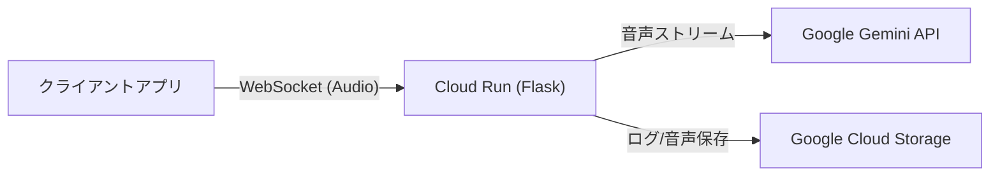

このファイルをプロジェクトのルートディレクトリに保存してください。GitHubリポジトリのトップページとして機能します。

-----

# Live Talk Service (Backend)

Google Gemini API (Multimodal Live API) を活用したリアルタイム音声対話アプリケーションのバックエンドサービスです。
Flask と WebSocket を使用して、低遅延でのAIとのストリーミング対話を実現し、会話ログを Google Cloud Storage (GCS) に保存します。

## 📖 特徴

  * **リアルタイム音声対話*gitgit push origin mainock`) と Gemini 2.0 Flash Exp モデルによる低遅延な音声対話。
  * **ストリーミング応答**: Gemini API の `response_modalities=["AUDIO"]` を利用し、生成された音声を即座にクライアントへ送信。
  * **会話ログ保存**: 会話の内容と音声データを Google Cloud Storage に自動バックアップ。
  * **スケーラビリティ**: Google Cloud Run 上でのサーバーレス動作（コンテナベース）。
  * **Docker対応**: 軽量な `python:3.10-slim` ベースのコンテナイメージ。

## 🏗 アーキテクチャ



## 📂 ディレクトリ構成

```text
.
├── Dockerfile
├── app.py
├── docks
│   └── set,ini
├── logs
│   ├── log_20251201_031113.txt
│   ├── log_20251201_031145.txt
│   ├── log_20251201_031442.txt
│   ├── log_20251201_031718.txt
│   ├── log_20251201_032631.txt
│   ├── log_20251201_040629.txt
│   ├── log_20251201_041028.txt
│   ├── log_20251201_042823.txt
│   ├── log_20251201_042948.txt
│   └── log_20251201_043844.txt
├── readme.md
├── requirements.txt
└── templates
    ├── index.html
    └── test.txt        
```

## 🚀 ローカルでのセットアップと実行

### 前提条件

  * Python 3.10 以上
  * Google Cloud プロジェクト（Gemini APIキー取得済み）

### 1\. リポジトリのクローン

```bash
git clone <https://github.com/ktwebsite/live_talk_app_realtime>
cd live-talk-service
```

### 2\. 仮想環境の作成と依存関係のインストール

```bash
python -m venv venv
source venv/bin/activate  # Windowsの場合は: venv\Scripts\activate
pip install -r requirements.txt
```

### 3\. 環境変数の設定

`.env` ファイルを作成するか、ターミナルで環境変数をエクスポートします。

**必須:**

```bash
export GEMINI_API_KEY="AIzaSy..."
```

**任意 (ログ保存機能を使う場合):**

```bash
export GCS_BUCKET_NAME="your-bucket-name"
export GOOGLE_APPLICATION_CREDENTIALS="/path/to/key.json" # ローカル実行時のみ必要
```

### 4\. アプリケーションの起動

```bash
python app.py
```

起動後、 `ws://localhost:5000/ws/realtime` でWebSocket接続が可能です。

-----

## 📡 API 仕様

### 1\. ヘルスチェック

  * **URL:** `/`
  * **Method:** `GET`
  * **Response:** `200 OK` (HTMLページを返します)

### 2\. WebSocket エンドポイント (音声対話)

  * **URL:** `/ws/realtime`
  * **Protocol:** `ws://` (ローカル) または `wss://` (本番環境)
  * **Description:** Gemini API との双方向音声ストリーミングを中継します。

### 3. フィードバック & ログ保存

  * **URL:** `/feedback`
  * **Method:** `POST`
  * **Content-Type:** `multipart/form-data`
  * **Parameters:**
    * `log`: 会話ログ (JSON文字列)
    * `audio`: 音声ファイル (Blob/File)
  * **Description:** 会話終了後にログと音声を GCS にアップロードします。


#### 通信フォーマット

**クライアント送信 (Request):**

```json
{
  "text": "こんにちは、元気ですか？"
}
```

**サーバー受信 (Response):**

サーバーからは2種類のメッセージがJSON形式で送られます。

1.  **生成途中 (Chunk):** 文字が生成されるたびに送られます。
    ```json
    {
      "type": "chunk",
      "text": "はい、"
    }
    ```
2.  **生成完了 (Complete):** すべての回答が完了した時に送られます。
    ```json
    {
      "type": "complete",
      "full_text": "はい、元気です！何かお手伝いしましょうか？"
    }
    ```

-----

## 🐳 Docker ビルドと実行

ローカルでコンテナとして動作させる場合の手順です。

```bash
# ビルド
docker build -t live-talk-app .

# 実行 (環境変数を渡す)
docker run -p 5000:5000 --env-file .env -v $(pwd):/app live-talk-app

```

-----

## ☁️ Google Cloud Run へのデプロイ

通常は GitHub Actions (CI/CD) 経由でデプロイされますが、手動で行う場合は以下を使用します。

```bash
# 1. Artifact Registry へビルド & プッシュ
gcloud builds submit --tag asia-northeast1-docker.pkg.dev/[PROJECT_ID]/live-talk-repo/live-talk-service .

# 2. Cloud Run へデプロイ
gcloud run deploy live-talk \
  --image asia-northeast1-docker.pkg.dev/[PROJECT_ID]/live-talk-repo/live-talk-service \
  --region asia-northeast1 \
  --allow-unauthenticated \
  --set-env-vars GEMINI_API_KEY="AIzaSy...",GCS_BUCKET_NAME="your-bucket"
```

### 必要なIAM権限

Cloud Run のサービスアカウントには以下の権限が必要です（GCSを使用する場合）。

  * `roles/storage.objectCreator` (ストレージ オブジェクト作成者)

-----

## 🛠 技術スタック

  * **Python 3.10-slim**
  * **Flask 3.x**: Webフレームワーク
  * **Flask-Sock**: WebSocketサポート
  * **Google Generative AI SDK**: Gemini モデルへのアクセス
  * **Google Cloud Storage Client**: ログ保存
  * **Gunicorn**: 本番環境用WSGIサーバー

## 📝 License

This project is licensed under the MIT License.